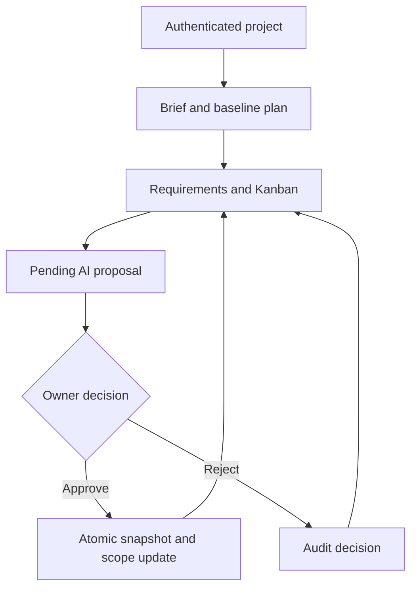

# VINSETT Forge AI

[](https://github.com/Vinsett07/vinsett-forge-ai/actions/workflows/ci.yml)

**v0.6.2 — managed Netlify database and AI Gateway deployment.**

VINSETT Forge AI turns a product brief into a traceable software project: versioned plans, requirements, acceptance criteria, tasks, Kanban and an audit trail. AI-generated scope remains pending until the project owner explicitly approves it.

M1–M6 are implemented. Local type checking, lint, domain tests and production compilation have been executed. PostgreSQL/browser validation runs in GitHub Actions; production deployment and a live AI-provider request remain separate release gates. See [validation evidence](docs/VALIDATION.md) and [the recovery record](docs/RECOVERY_2026-10-04.md).

## Features

- Registration, login/logout, signed HttpOnly sessions and salted `scrypt` password hashes.
- PostgreSQL/Drizzle persistence and projects isolated by owner.
- Structured briefing and deterministic baseline planning with versioned snapshots.
- Requirements, acceptance criteria, five-stage Kanban and activity history.
- Audited AI proposals with approve/reject decisions and atomic application of scope.
- Deterministic planning without an external key; optional OpenAI Responses adapter.
- Read-only GitHub repository, issue, PR, commit and Actions context.
- Health endpoint, security headers, process-local abuse guards and deployment configuration.

## Product flow



## Architecture

| Responsibility | Implementation |
| --- | --- |
| Web UI and API | Next.js App Router, React, TypeScript |
| Domain | Dependency-free TypeScript contracts and validators |
| Persistence | PostgreSQL, Drizzle ORM, four ordered SQL migrations |
| Authentication | `scrypt`, HMAC-signed HttpOnly cookie |
| AI | Validated proposals, provider audit metadata, explicit human approval |
| GitHub | Read-only REST adapter |
| Validation | Node tests, ESLint, TypeScript, production build, Playwright with PostgreSQL |

## Run locally

Requires Node.js 22.13+ and PostgreSQL. Copy `.env.example` to `.env.local`, set `DATABASE_URL` and a random `SESSION_SECRET` of at least 32 characters, and set `AI_PROVIDER=deterministic` for a key-free first run. Never commit credentials.

```bash
npm ci
node --env-file=.env.local scripts/migrate.mjs
npm run dev
```

The migration command above explicitly loads `.env.local`; `npm run db:migrate` expects exported environment variables. Both it and Netlify use the idempotent SQL files under `netlify/database/migrations`. Netlify manages production migration tracking and publication. Back up production before changing schema.

## Validate

```bash
npm run lint
npm run typecheck
npm test
npm run build
npx playwright install chromium
```

Run browser tests only against a disposable database. They create test accounts and projects, exercise scope approval and delete their test project:

```bash
node --env-file=.env.local node_modules/@playwright/test/cli.js test
```

GitHub Actions uses PostgreSQL 17, reapplies all four migrations, verifies lint/types/tests/build, and runs Chromium against the production server. Browser reports and failure traces are retained for seven days. The full journey covers registration, persistence, Kanban, owner isolation, approval, rejection, duplicate/concurrent decisions, logout/login and deletion.

## Milestones and remaining work

| Milestone | State |
| --- | --- |
| M1 — Foundation | Implemented |
| M2 — Authentication and persistence | Implemented; covered by the database/browser CI journey |
| M3 — Delivery workspace | Implemented; covered by the database/browser CI journey |
| M4 — Human-reviewed AI | Deterministic flow implemented; live provider request pending |
| M5 — GitHub context | Read-only integration implemented; deployed synchronization pending |
| M6 — Release readiness | Pipeline and runbooks implemented; production acceptance pending |

Remaining release work: production database and secrets, a separate Netlify site, deployed `/api/health`, the authenticated browser journey on that site, live GitHub synchronization, an optional real AI-provider request, and a backup/restore rehearsal. A passing build alone does not establish production readiness.

## Documentation

- [Roadmap](docs/ROADMAP.md)
- [Architecture](docs/ARCHITECTURE.md)
- [AI layer](docs/AI_LAYER.md)
- [GitHub integration](docs/GITHUB_INTEGRATION.md)
- [Operations and backup/restore](docs/OPERATIONS.md)
- [Portfolio case study](docs/PORTFOLIO_CASE_STUDY.md)
- [Validation evidence](docs/VALIDATION.md)
